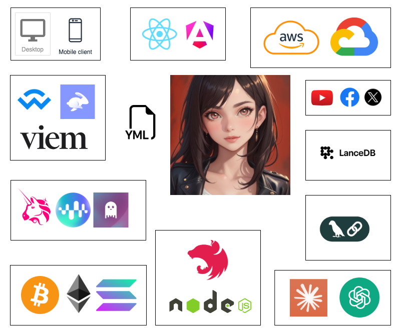

# Agent H 🤖 

> Autonomous Agent Framework for NodeJS

Agent-H, the little sister of [EizaOS](https://github.com/elizaOS/eliza), is a lightweight and modular framework that enables the management of multiple AI assistants. While inspired by the EizaOS project, This framework is designed to be more modular, extensible, and easier to use and scale. As a younger sibling in the AI agent family, Agent-H builds upon the foundation laid by ElizaOS, offering a fresh approach to autonomous agent frameworks with a focus on simplicity and blockchain integration.


<div align="center">
  
</div>

## Project Description
Agent-H represents a sophisticated autonomous agent framework designed for NodeJS, offering an innovative approach to AI assistant management with seamless blockchain integration. Emerging as the younger sibling of ElizaOS, this framework distinguishes itself through its modular architecture and advanced capabilities. The core of Agent-H is built around a robust service that leverages OpenAI's powerful language models to create intelligent and responsive assistants.

At its heart, the framework enables dynamic creation and management of multiple AI agents, each capable of executing complex tasks through sophisticated tool handling and inter-agent communication. The system supports creating threads, sending messages, and managing conversations with remarkable flexibility. What sets Agent-H apart is its intelligent agent delegation mechanism, where different assistants can collaborate and execute tools across the ecosystem, creating a more interconnected and powerful AI environment.

The framework's design emphasizes extensibility and ease of use, allowing developers to quickly configure new assistants by defining their specific instructions, tools, and behaviors through simple configuration files. Its advanced run management system ensures robust error handling, tool execution, and seamless interaction between agents. By integrating logging, dynamic tool management, and a flexible architecture, Agent-H provides developers with a powerful toolkit for building sophisticated, context-aware AI applications that can adapt and scale according to project requirements.

Unleash the power of intelligent, autonomous agents in the decentralized world with Agent H!

## 👀 Architecture Overview

<div align="center">
  
</div>

### 🤖 Agents

Agents are one of the core building blocks from the Agent-H framework, representing individual AI assistants that can interact with users, execute tasks, and communicate with other agents. Each agent is defined by a configuration file that specifies its name, description, and a list of tools that it can execute. By defining agents, developers can create a wide range of AI applications with different capabilities and behaviors. Each agent are defined by a configuration file that specifies its name, description, and a list of tools that it can execute. All files are placed in the `./characters` directory.

### 🔧 Tools

Tools are one of the building blocks from the Agent-H framework, providing a way to interact with the AI agents and execute specific tasks. Each tool is defined by a configuration file that specifies its name, description, and handler function. The handler function is responsible for processing the tool's logic and generating a response that can be sent back to the user. By defining tools, developers can create a wide range of functionalities.

- Tools files configureation are defined in the `./tools` directory.
- Tools handler functions are defined in the `./src/tools` directory.

For example, a tool might be used to fetch data from an external API, perform calculations, or interact with a blockchain. By defining tools, developers can extend the functionality of the AI agents and create more sophisticated applications.

### Controlers

Class Controllers are optionnal and can be used to manage specific type of logic. Each controller is defined by a `Class` file that implement `start()` and `stop()` methods.  
All controles have to be placed in the `./src/agents` directory. Use existing examples controllers as a template to create your own.

## ✨ Features

- **🤖 AI Assistant manager**: Orchestrate and manage multiple AI agent
- **📦  Minimal Design**: Streamlined architecture for efficient operation
- **🛠️ Highly extensible**: Create your own tools and agents assistant
- **🔗 Direct blockchain interactions**: Provide default tools for EVM Blockchain interactions
- **🔒 Secure and private API server Endpoint**: Include a NestJS server that expost Agent to HTTP Request
- **🖥 Desktop and Mobile PWA UI**: Include UI for desktop Electron App & Angular Progressive Web Application
- **📚 Easily configure & run:** Only one programming language & configuration based on yml file or with UI
- **🚀 Ready to use and deploy** Download, install, setup & deploy in less than 5 minutes


## 🚀 Quick Start

### Prerequisites

- [OpenIA API Key](https://platform.openai.com/settings/organization/general) *(required)*
- [Node.js 20+](https://docs.npmjs.com/downloading-and-installing-node-js-and-npm) *(non-required using Desktop App packaged with Electron)*

### Start by clone the repository

```bash
git clone https://github.com/hexaonelabs/ia-agent-h
cd ia-agent-h
cp .env.example .env
cp agent-h.yml.example characters/agent-h.yml
npm install
```

### Environment Variables
1. open `.env` file and add your OpenAI API Key, Twitter credentials and other configuration that you want to use.
2. Provide the seed phrase or privateKey of the wallet that you want to use to interact with the blockchain. This wallet will be used to sign transactions and interact with the blockchain.

### Edit Agent character files configuration
1. open `characters/agent-h.yml` file and edit the character name, description and other details. This file provide configurations for the main orchestrator agent. Do not remove this file.
2. add, edit or remove assistant with character file. Each character file will be loaded to generate an assistant based on the configuration provided in the file.

### Agent Controller
Some agent are designed to execute a specific task or to handle a specific type of request. To define an agent with controller, just provide `Ctrl: agents/{AGENT_CTRL}.agent` to the file configuration yml. You can create your own agent controller by creating a new file inside `src/agents` directory and export a Object with a `start()` function that will be called to run dedicated logic.

### Edit tool files configuration
Add, edit or remove tools with file inside `tools/{TOOL_FILE}.yml` directory. Each tool file will be loaded to generate a tool based on the configuration provided in the file. The tool have an `Handler` property that should be the name of the file inside `src/tools` directory that will be used to handle the tool logic. 

You can create your own tools by creating a new file inside `src/tools` directory and export a function that will be called when the tool is used. The function should return data that will be send to the main agent to generate a response to the user.

### Start development server
```bash
npm run serve:server
```

### Start production server
```bash
npm run start:server
```

or you can use `pm2` to run the server in background. Ensure that you have `pm2` installed globally on your machine before running the command below.

```bash
npm run start:pm2
```

*Note: The server will be running on `localhost:3000` by default. You can change the port by editing the `.env` file. You have multiples auther build in srcipts that you can use to manage the server, lint the code, run test and more. Check the `package.json` file for more information.*

### Starting development browser ui (Angular)
```bash
npm run serve:pwa
```

*Note: The browser ui will be running on `localhost:4200` by default. You can change the port by editing the `angular.json` file.*

### Build production browser ui (Angular)
```bash
npm run build:pwa
```

### Starting development desktop ui (Electron)
```bash
npm run start:desktop
```
*Note: The desktop ui application will be running on your machine. You can change the config by editing the `electron-builder.json` file.*

### Build production desktop ui (Electron)
```bash
npm run make:desktop
```

*Note: The desktop ui application will be build in the `dist/packages` directory. You can change the config by editing the `electron-builder.json` file.*

## Contributing
Contributions are welcome and appreciated. To contribute to this project, please fork the repository, create a new branch and submit a pull request. For major changes, please open an issue first to discuss what you would like to change.

You can find more information about contributing to this project in the CONTRIBUTING.md file.

## License
This project is open-source and distributed under the MIT License. See LICENSE for more information.

## Core Team
This project is developed by HexaOne Labs, a team that trust in the power of blockchain technology and decentralized finance (DeFi) to build a better world.

## Support
If you like this project, please consider supporting it by giving a ⭐️ on Github and sharing it with your friends!